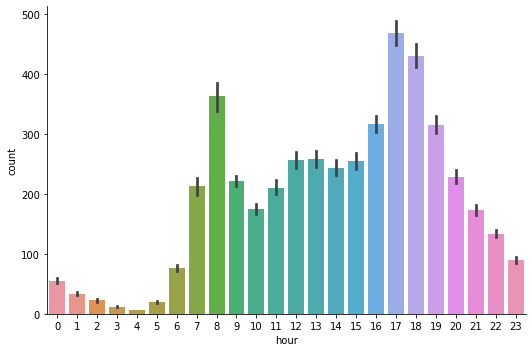
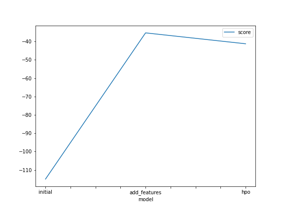
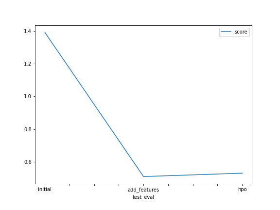

# Report: Predict Bike Sharing Demand with AutoGluon Solution
#### Piyush Raj

## Initial Training
### What did you realize when you tried to submit your predictions? What changes were needed to the output of the predictor to submit your results?
The predictions for this competition are required to be greater than zero. There were some cases where the model predicted a value less than zero. These values had to replaced with zeros so that we could submit the results from evalutation.

### What was the top ranked model that performed?
The "WeightedEnsemble_L3" was the top ranked model in the models tested by AutoGluon. 

## Exploratory data analysis and feature creation
### What did the exploratory analysis find and how did you add additional features?
Exploratory analysis helped identify additional features like extracting information about hour, day, month, etc. from the `datetime` feature. 
Also, features `season` and `weather` were of integer type which could be interpreted by the model as the continuous features thus we changed their type to the category type.

### How much better did your model preform after adding additional features and why do you think that is?
There was a big improvement in the model performance by adding additional features. This is because the features we added carried additional signal for the model to better its prediction which was difficult to do had these features not been present. 
For example - The value we are trying to predict, `count` varies siginficantly with change in the `hour` value -

## Hyper parameter tuning
### How much better did your model preform after trying different hyper parameters?
The performance did not improve (compared to the model with added features) after tyring different hyper parameters. The model performed slightly better with the default parameters.

### If you were given more time with this dataset, where do you think you would spend more time?
I would definitely work on creating more features that might be helpful for the model. For example, an additional feature we could create - Whether the day was a weekday or a weekend. We could try and come up with similar features that might help our model perform better.

### Create a table with the models you ran, the hyperparameters modified, and the kaggle score.
|        model | nn_num_epochs | gbm_num_boost_round | time |   score |
|-------------:|--------------:|--------------------:|------|--------:|
|      initial |       default |             default | 600  | 1.39316 |
| add_features |       default |             default | 600  | 0.50872 |
|          hpo |            10 |                 100 | 600  | 0.52945 |

### Create a line plot showing the top model score for the three (or more) training runs during the project.

### Create a line plot showing the top kaggle score for the three (or more) prediction submissions during the project.

## Summary
* In this project, I got to work with on Bike Share Demand prediction problem where I used AutoGluon to automatically try different models and their combination for predicting the bike rental demand at a given hour and come up with the best model for the task. 
* I also used Exploratory Data Analysis to add additional features by extracting hour, day, and month features from the datetime column which helped boost model's performance.
* I also performed Hyperparameter Tuning to get the optimal set of hyperparameters for our model. This didn't result in any siginificant improvements but helped me understand a key part in the model building pipline.
* At an overall level, this project helped me better understand the important steps involved in the building ML models - data collection, EDA, feature engineering, model training and evaluation, hyperparameter tuning, and iteratively improving the model's performance with new features, hyperparameters.
